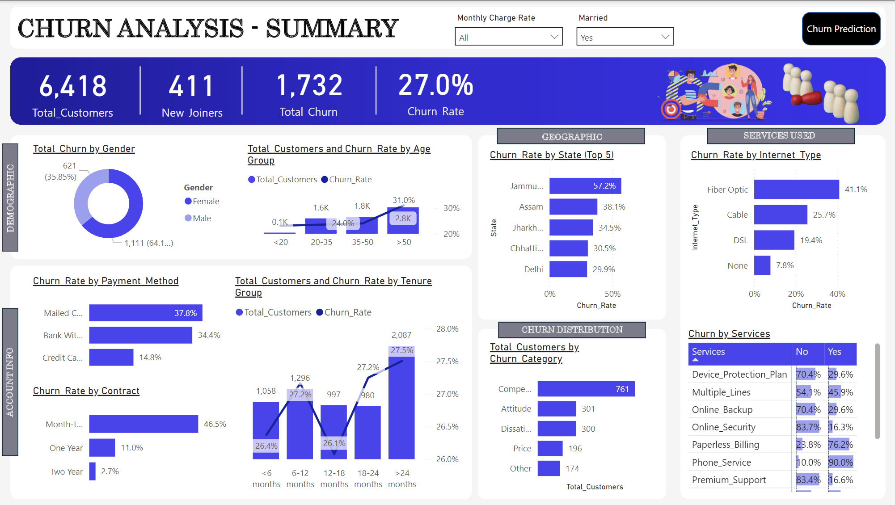
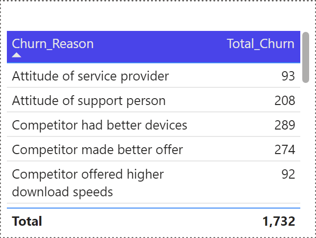
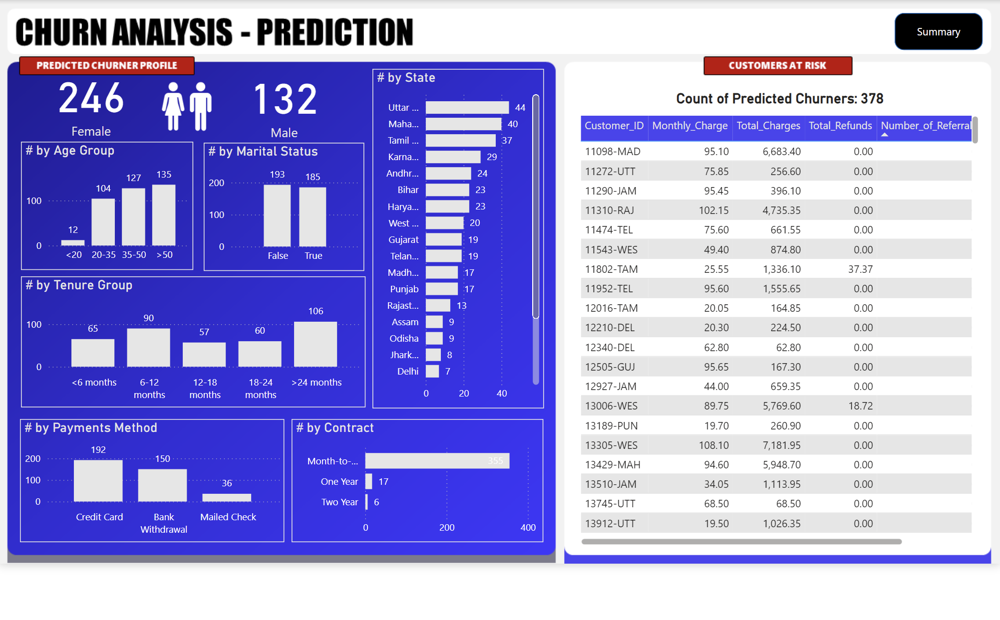

# 📊 Telecom Churn Analysis - Power BI Dashboard

The **Telecom Churn Analysis Power BI Dashboard** offers comprehensive insights into customer churn patterns, enabling data-driven decisions to enhance customer retention. This dashboard leverages advanced **Power Query transformations** and **DAX measures**, alongside interactive filtering capabilities, to explore churn metrics, reasons, and predictions.

---

## 🏆 Key Objectives

1. **Churn Analysis**: Analyze churn metrics and trends for existing customers using database views (`vw_ChurnData`).
2. **Churn Reasons**: Identify and visualize key drivers behind customer churn through interactive tooltip-based dashboards.
3. **Churn Prediction**: Predict future churn for new customers using machine learning outputs and database views (`vw_JoinData`).
4. **Dynamic Insights**: Enable stakeholders to slice and dice data with filters for actionable insights.

---

## 🔗 Data Source and SQL Processing

- **Data Source**: The [`Customer_Data.csv`](../Dataset/Customer_Data.csv) for this dashboard is stored in a **Microsoft SQL Server** database.
- After **uploading the initial dataset** to the SQL Server and performing **data processing** and **cleaning** (refer to [`SQL_Queries.sql`](../SQL/SQL_Queries.sql)) in the SQL folder), two **database views** were created:
  - **`vw_ChurnData`**: Focuses on existing customers (statuses "Churned" or "Stayed"), used by **Page 1 (Summary)** and **Page 2 (Churn Reasons)**.
  - **`vw_JoinData`**: Focuses on newly joined customers (status "Joined"), used by **Page 3 (Churn Prediction)** for future churn analysis.
- These views provide a structured way to filter and analyze relevant segments of customers for churn reporting and prediction.

---

## 📊 Dashboard Pages

### **1. Summary Page (Page 1)**

- **Purpose**: Provides an overview of churn metrics for **existing customers**.
- **Data Source**: This dashboard utilizes the `vw_ChurnData` view from the database, which includes only customers with statuses "Churned" or "Stayed."
- **Key Features**:
  - **Total Customers**: Displays the total count of existing customers.
  - **Total Churn**: Highlights the total number of churned customers.
  - **Churn Rate**: Shows the percentage of churned customers.
  - **Visualizations**:
    - Churn rate by **Gender**, **Age Group**, **State**, **Payment Method**, **Contract Type**, and **Tenure Group**.
  - **Insights**:
    - Identify high-risk segments for targeted retention strategies.

---

### **2. Churn Reasons Tooltip (Page 2)**

- **Purpose**: Explore the primary reasons behind customer churn.
- **Key Features**:
  - Tooltip-based drill-through dashboard with detailed visualizations.
  - Breakdown of churn reasons, such as:
    - **Competitor Offers**.
    - **Service Issues**.
    - **Better Devices**.
  - **Insights**:
    - Help businesses understand why customers are leaving and identify areas for improvement.

---

### **3. Churn Prediction Page (Page 3)**

- **Purpose**: Predict future churn for **joined customers** and highlight high-risk individuals for proactive action.
- **Data Source**: This dashboard uses the `vw_JoinData` view from the database, which includes customers with the status "Joined."
- **Key Features**:
  - **Predicted Churn Count**: Total number of customers likely to churn.
  - **Churn Probability Distribution**: Displays predicted churn probabilities for each customer.
  - **Visualizations**:
    - Churn segmentation by demographics, tenure, and service usage.
  - **Insights**:
    - Identify patterns and predict future churn to facilitate retention strategies.

---

## 📋 Data Preparation

### **Power Query Transformations**

- **Churn Status Column**: Created a binary column to indicate churn status (`1` for churned, `0` otherwise).
- **Monthly Charge Range**: Binned monthly charges into categories (`< 20`, `20-50`, `50-100`, `> 100`).
- **Age and Tenure Groups**: Grouped customers by age and tenure for better segmentation.
- **Unpivoted Services Data**: Restructured service columns for streamlined analysis.

Detailed steps are documented in [`Power_Query_Transformations_and_DAX_Measures.md`](./Power_Query_Transformations_and_DAX_Measures.md).

---

## 🧮 DAX Measures

The following measures were used across dashboards:

1. **Total Customers**:
   ~~~dax
   Total Customers = COUNT(prod_Churn[Customer_ID])
   ~~~

2. **Total Churn**:
   ~~~dax
   Total Churn = SUM(prod_Churn[Churn Status])
   ~~~

3. **Churn Rate**:
   ~~~dax
   Churn Rate = [Total Churn] / [Total Customers]
   ~~~

4. **Predicted Churn Count**:
   ~~~dax
   Count Predicted Churners = COUNT(Predictions[Customer_ID]) + 0
   ~~~

Complete measures are detailed in [`Power_Query_Transformations_and_DAX_Measures.md`](./Power_Query_Transformations_and_DAX_Measures.md).

---

## 🌟 Insights

- **Existing Customers (Page 1)**:
  - Higher churn rates observed in customers with short tenure (<6 months) and specific payment methods (e.g., Mailed Check).
  - Certain states and age groups show elevated churn patterns, indicating potential retention challenges.

- **Churn Reasons (Page 2)**:
  - Competitor-driven churn is a significant factor, especially for customers seeking better offers or devices.
  - Service quality issues contribute heavily to churn.

- **Future Predictions (Page 3)**:
  - High-risk customers can be identified early, enabling proactive engagement strategies.
  - Predictions align with historical churn trends, validating the accuracy of the model.

---

## ⚙️ Technologies Used

- **Power BI**: For creating interactive dashboards and visualizations.
- **DAX (Data Analysis Expressions)**: For dynamic calculations and measures.
- **Power Query**: For data preprocessing and transformations.
- **SQL**: For database views (`vw_ChurnData`, `vw_JoinData`) to segment customers.

---

## 📁 File Structure

~~~plaintext
BI/
├── Dashboards/
│   ├── Summary_Dashboard.png          # Screenshot of the Summary page
│   ├── Churn_Reason_Tooltip.png       # Screenshot of the Churn Reasons page
│   ├── Churn_Prediction_Dashboard.png # Screenshot of the Churn Prediction page
├── Churn_Analysis.pbix                # Power BI dashboard file
├── Power_Query_Transformations_and_DAX_Measures.md # Detailed transformations and measures
├── readme.md                          # This documentation file
~~~

---

## 🛠️ How to Use

1. Clone the repository:
   ~~~bash
   git clone (https://github.com/Mohamed-Arafaath/Telecom_Churn_Analysis
   ~~~
2. Open the `Churn_Analysis.pbix` file in Power BI Desktop.
3. Refresh the data sources to update metrics.
4. Explore the dashboard by interacting with filters and slicers.

---

## 🚀 Conclusion

The **Telecom Churn Analysis Power BI Dashboard** empowers businesses with actionable insights into churn behavior, reasons, and future risks. Its interactive and predictive capabilities enable strategic decision-making to enhance customer retention and satisfaction.

---

## 📧 Contact

For questions or contributions, feel free to raise an issue or contact me:

**Author**: [Mohamed Arafaath](https://www.linkedin.com/in/mohamed-arafaath/)  
**Email**: mohamed_arafaath@outlook.com  

